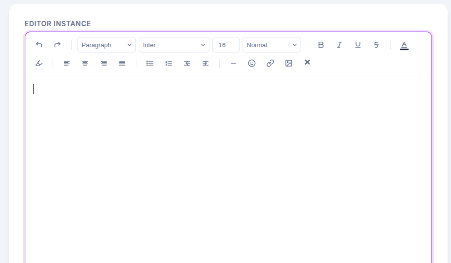

# @meenainwal/rich-text-editor 🚀

[](https://www.npmjs.com/package/@meenainwal/rich-text-editor)
[](https://www.npmjs.com/package/@meenainwal/rich-text-editor)

A premium, ultra-lightweight, framework-agnostic rich text editor built entirely with Vanilla TypeScript. Featuring a sophisticated **Slate & Indigo** design system, it provides a flawless writing experience out-of-the-box.



## ✨ Why Choose This Editor? (Pros & Cons)

### 👍 Pros
- **Zero Dependencies**: Pure Vanilla JS/TypeScript. No bloated third-party libraries.
- **Microscopic Footprint**: Only **~25kB** compressed (Gzipped), meaning zero impact on your site's load time.
- **Framework Agnostic**: Drop it into React, Vue, Angular, Svelte, or plain HTML projects seamlessly.
- **Auto-Formatting Magic**: Intelligently parses pasted HTML strings automatically into perfectly formatted rich text.
- **Beautiful UI**: Modern aesthetics curated with a polished Slate & Indigo color palette, smooth transitions, and dynamic SVG icons.
- **Local Image Uploads**: Natively integrates with the OS file picker for rapid inline base64 image insertions.
- **Flexible Styling**: Full control over font families, complex line heights, text colors, and highlighting.

### 👎 Cons (Current Limitations)
- Base64 image storage can increase the raw output string size for very large images (Backend S3 uploading adapter coming soon).
- Lacks advanced table grid manipulations in the current version.
- Markdown shortcut typing (e.g., typing `#` for H1) is not natively supported yet.

---

## 📦 Installation

```bash
npm install @meenainwal/rich-text-editor
```

## 🚀 Quick Start

### Basic Usage (Vanilla JS)

```javascript
import { CoreEditor } from '@meenainwal/rich-text-editor';
import '@meenainwal/rich-text-editor/dist/rich-text-editor.css'; // Import the CSS!

const container = document.getElementById('editor');
const editor = new CoreEditor(container, {
  placeholder: 'Type something beautiful...',
  autofocus: true
});

// To extract the customized HTML:
const htmlOutput = editor.getHTML();
```

### Via CDN (Direct Download, No NPM Required)

You can instantly drop the editor into any standard HTML page without installing tools or bundlers. Simply use standard CDN links (like `unpkg.com` or `jsdelivr.net`):

```html
<!-- Load the beautifully styled CSS -->
<link rel="stylesheet" href="https://unpkg.com/@meenainwal/rich-text-editor/dist/rich-text-editor.css">

<!-- Load the Logic Script as an ES Module -->
<script type="module">
  import { CoreEditor } from 'https://unpkg.com/@meenainwal/rich-text-editor/dist/test-editor.mjs';

  const container = document.getElementById('editor');
  const editor = new CoreEditor(container);
</script>
```

### In React

```tsx
import { useEffect, useRef } from 'react';
import { CoreEditor } from '@meenainwal/rich-text-editor';
import '@meenainwal/rich-text-editor/dist/rich-text-editor.css';

export const EditorComponent = () => {
  const containerRef = useRef<HTMLDivElement>(null);

  useEffect(() => {
    if (containerRef.current) {
        new CoreEditor(containerRef.current);
    }
  }, []);

  return <div ref={containerRef} />;
};
```

---

## 🗺️ Future Roadmap & Upcoming Updates

As the project manager, we are aggressively expanding this editor. Next releases will feature:

1. **Phase 2.1 - Markdown Power:** Seamless markdown shortcuts (typing `**bold**`, `## Header`) that auto-convert to rich text instantly.
2. **Phase 2.2 - Table Support:** An interactive grid UI to insert, resize, and style complex HTML tables.
3. **Phase 2.3 - Framework Wrappers:** Official, first-party wrapper components for `<ReactEditor />` and `<VueEditor />` for even faster plug-and-play.
4. **Phase 2.4 - Advanced Image Handlers:** Providing hooks to intercept image uploads and pipe them to external buckets (AWS S3, Cloudinary) to return URLs instead of raw base64.

---

## ⚙️ Configuration Options

| Option | Type | Default | Description |
| :--- | :--- | :--- | :--- |
| `placeholder` | `string` | `undefined` | The placeholder text when the editor is empty. |
| `autofocus` | `boolean` | `false` | Whether to focus the editor automatically on initialization. |

## 🛠 API Methods

- `getHTML()`: Returns the content as a sanitized HTML string.
- `setHTML(html)`: Programmatically sets the editor content.
- `focus()`: Forces focus onto the editor.
- `execute(command, value)`: Execute standard editor commands internally.

## 📄 License

MIT © [Anuj Nainwal](https://github.com/anujnainwal)
